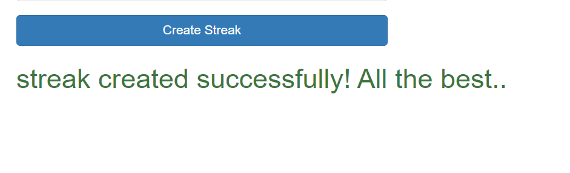
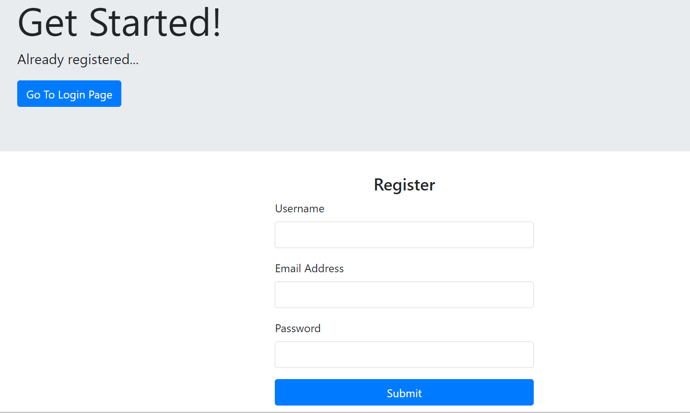

<!--
*** Thanks for checking out this README Template. If you have a suggestion that would
*** make this better, please fork the repo and create a pull request or simply open
*** an issue with the tag "enhancement".
*** Thanks again! Now go create something AMAZING! :D
***
***
***
*** To avoid retyping too much info. Do a search and replace for the following:
*** github_username, repo_name, twitter_handle, email
-->


<!-- PROJECT SHIELDS -->
<!--
*** I'm using markdown "reference style" links for readability.
*** Reference links are enclosed in brackets [ ] instead of parentheses ( ).
*** See the bottom of this document for the declaration of the reference variables
*** for contributors-url, forks-url, etc. This is an optional, concise syntax you may use.
*** https://www.markdownguide.org/basic-syntax/#reference-style-links
-->


<!-- PROJECT LOGO -->
<br />
<p align="center">
  <a href="https://github.com/github_username/repo_name">
    
  </a>

  <h3 align="center">ProductiveBee</h3>

  <p align="center">
    ProductiveBee is a platform that helps say no to procrastination and be consistent, not every pro is better than a con :)
    <br />
    <a href="https://github.com/ProductiveBee/PBBackend"><strong>Explore the docs »</strong></a>
    <br />
    <br />
  </p>
</p>


<!-- TABLE OF CONTENTS -->
## Table of Contents

* [About the Project](#about-the-project)
* [Features] (#Features)
* [screenshots](#screenshots)
  * [Built With](#built-with)
* [Getting Started](#getting-started)
  * [Prerequisites](#prerequisites)
  * [Installation](#installation)
* [Usage](#usage)

* [Contributing](#contributing)
* [License](#license)
* [Contributors](#contributors)


<!-- ABOUT THE PROJECT -->
## About The Project


  


Come on kid, this is your dream, give them the wings to fly. 
There are so many opportunities that go behind only because of the procrastination one shows in opening the doors. 
Actively learning new things, being consistent, being productive, managing tasks, 
spending time with family are the keys to becoming happy, and fulfilling the dreams.


## Features
 1. When the dreamer wants to learn something new, the best way to master it is to work on it for a few days. The streak challenge! No, there is no dopamine pressure of getting more likes or views, it's simply you and the streak. Well, you get a reward in the score if you complete your target streak, and a penalty in the score if you don't. <br/>
 2. Manage multiple tasks efficiently. Get a schedule and a discipline to follow it religiously because focussing on one thing at a time is always helpful. <br/>
 3. If you are currently learning react, your timeline will inspire you more because you can see what other dreamers are learning when doing react in their streak motivating you with innovative projects and working hard. Get a community of learning.  
This tracker would help you realize how awesome you can be.
## screenshots

 
 
 
  
  
  
  
  
   
  
  
   


### Built With

* SpringBoot
* HTML,CSS
* JavaScript
* MySQL
* Bootstrap


<!-- GETTING STARTED -->
## Getting Started

To get a local copy up and running follow these simple steps:

### Prerequisites

This is an example of how to list things you need to use the software and how to install them.
* Have maven installed. You can follow the below link for the same.  
  https://mkyong.com/maven/how-to-install-maven-in-windows/  
* To have a local mySQL database running make the following modifications to the application.properties file:  
  1. Your username  
  2. Your password  
  3. Your database name  
  
### Installation

1. Clone the repository 
```sh
 https://github.com/ProductiveBee/PBBackend.git
```
2. Install the required Maven dependencies using the following commands
```sh
mvn clean
maven compile
mnv install
```
3. After doing so, you will have your server up and running @localhost:8080  


<!-- USAGE EXAMPLES -->
## Usage

Use this space to show useful examples of how a project can be used. Additional screenshots, code examples and demos work well in this space. You may also link to more resources.

_For more examples, please refer to the [Documentation](https://example.com)_


<!-- ROADMAP -->
## Roadmap

See the [open issues](https://github.com/github_username/repo_name/issues) for a list of proposed features (and known issues).


<!-- CONTRIBUTING -->
## Contributing

Contributions are what make the open source community such an amazing place to be learn, inspire, and create. Any contributions you make are **greatly appreciated**.

1. Fork the Project
2. Create your Feature Branch (`git checkout -b feature/AmazingFeature`)
3. Commit your Changes (`git commit -m 'Add some AmazingFeature'`)
4. Push to the Branch (`git push origin feature/AmazingFeature`)
5. Open a Pull Request


<!-- LICENSE -->
## License

Distributed under the MIT License. See `LICENSE` for more information.


<!-- CONTACT -->
## Contributors  
 
 1. Dhwani Agarwal  
 2. Nikita Masand  
 3. Kritika Ravishankar  


<!-- MARKDOWN LINKS & IMAGES -->
<!-- https://www.markdownguide.org/basic-syntax/#reference-style-links -->
[contributors-shield]: https://img.shields.io/github/contributors/github_username/repo.svg?style=flat-square
[contributors-url]: https://github.com/github_username/repo/graphs/contributors
[forks-shield]: https://img.shields.io/github/forks/github_username/repo.svg?style=flat-square
[forks-url]: https://github.com/github_username/repo/network/members
[stars-shield]: https://img.shields.io/github/stars/github_username/repo.svg?style=flat-square
[stars-url]: https://github.com/github_username/repo/stargazers
[issues-shield]: https://img.shields.io/github/issues/github_username/repo.svg?style=flat-square
[issues-url]: https://github.com/github_username/repo/issues
[license-shield]: https://img.shields.io/github/license/github_username/repo.svg?style=flat-square
[license-url]: https://github.com/github_username/repo/blob/master/LICENSE.txt
[linkedin-shield]: https://img.shields.io/badge/-LinkedIn-black.svg?style=flat-square&logo=linkedin&colorB=555
[linkedin-url]: https://linkedin.com/in/github_username
[product-screenshot]: images/screenshot.png
